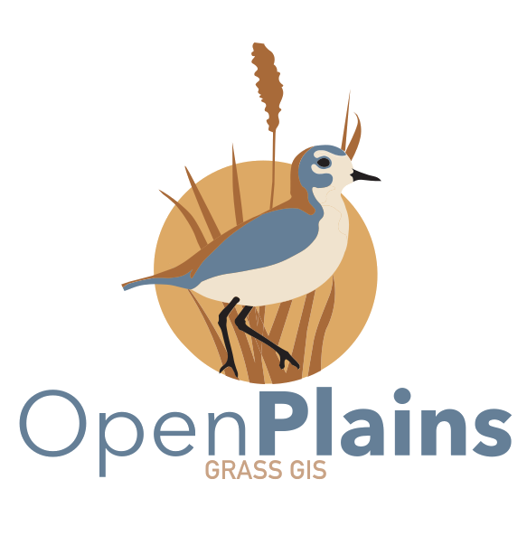

# TomorrowNowAPP

[](https://doi.org/10.5281/zenodo.7702537)
[](https://github.com/tomorrownow/TomorrowNowApp/actions/workflows/node.js.yml)
[](https://github.com/tomorrownow/TomorrowNowApp/actions/workflows/django.yml)



<!--  -->

> **Disclaimer:** The TomorrowNow project is currently in an experimental phase and therefore breaking changes and project restructuring will occur without notice. We recommend waiting until the first stable version is released before considering using the project in any form.

## Getting Started

Docker compose containers and client port bindings. Currently we are comparing different cloud optimaized geotiff (cog) servers so that is why there are so many at the moment.

| Service  | Description | Port |
| -----------   | ----------- | -------- |
| api           | Django 4.2.1  | 8005     |
| actinia | Actinia 4.1.0 | 8088     |
| webapp      | React       | 3000     |
| db      | Postgresql + PostGIS | 5431 |
| actinia-redis | redis | 6379 |
| django-redis-cache |  redis | 6370 |
| celery_worker |  celery | NA |
| titiler | titiler | 7000 |
| geoserver | geoserver | 8600 |

### Configuration

#### Settings

Update the settings file

* actinia/.sample.actinia.env -> .actinia.env
* actinia/sample.actinia.cfg -> actinia.cfg
* openplains_api/api/.sample.env -> .env
* geoserver/.sample.env -> .env

##### TODO

* Setup docker-compose-dev-local.yml
* Fix GCP in actinia/Dockerfile
* Run django migrations
* Auto create actinia postgres db and role

### Start app

```bash
docker compose up
```

### Stop app

```bash
docker compose down
```

## API

[Django Docker Docs](https://docs.docker.com/samples/django/)

### Create new app

Run inside of web container

```bash
docker compose run api python manage.py startapp <appname>
```

Creates or updates models and store changes as a migration

```bash
# Create migrations
docker compose run api python manage.py makemigrations <appname>

# Apply changes to database
docker compose run api python manage.py migrate
```

### Collect Static Files

```bash
docker compose run api python manage.py collectstatic
```

### View Django urls

```bash
docker compose run api python manage.py show_urls
```

### Start Django Shell

```bash
docker compose run api python manage.py shell
```

#### Start Django Jupyter Notebook

```bash
docker compose run api python manage.py shell_plus --notebook
```

```python
from savana.utils import actinia
actinia.locations()
```

### Testing

```bash
docker compose run api python manage.py test <appname>
```

## Front End (webapp/)

### Install new NPM modules

<https://www.docker.com/blog/keep-nodejs-rockin-in-docker/>

```bash

docker compose run webapp npm install

```
